# Processo de release

Este documento descreve o fluxo recomendado para preparar e publicar uma nova versão do projeto.

## Visão geral do fluxo

```mermaid
flowchart TB
    classDef human fill:#d4edda,stroke:#28a745,color:#155724
    classDef bot   fill:#cce5ff,stroke:#0056b3,color:#003d80
    classDef file  fill:#fff3cd,stroke:#b8860b,color:#664d00
    classDef gate  fill:#fce8e8,stroke:#c0392b,color:#7b0000

    subgraph DEV ["👤 Desenvolvimento  (humano)"]
        D1([Escreve código]):::human
        D2([Atualiza CHANGELOG.md\nseção Não Lançado]):::human
        D3([Atualiza src/pkg/CHANGELOG.md\ndo pacote alterado]):::human
        D1 --> D2 --> D3
    end

    F1[/src/**/*.cs/]:::file
    F2[/CHANGELOG.md/]:::file
    F3[/src\/pkg\/CHANGELOG.md/]:::file
    D1 -.modifica.-> F1
    D2 -.modifica.-> F2
    D3 -.modifica.-> F3

    subgraph PRC ["PR de código → main · qas · nugettest/qas"]
        PC1([Abre PR]):::human
        PC2{PR Validation 🤖\nversion-policy · build\ntestes · pack · assert-artifacts}:::gate
        PC3([Revisão e aprovação]):::human
        PC4([Merge]):::human
        PC1 --> PC2 --> PC3 --> PC4
    end

    D3 --> PC1

    subgraph PREP ["🤖 prepare-release.yml  (workflow_dispatch)"]
        PR1([Dispara:\nversion=X.Y.Z, target_branch]):::human
        PR2([Valida SemVer e\nmonotonicidade vs últimas tags]):::bot
        PR3([Cria branch release/vX.Y.Z]):::bot
        PR4([Atualiza VersionPrefix\nem Directory.Build.props]):::bot
        PR5(["Fecha § Não Lançado\nem CHANGELOG.md → [X.Y.Z]"]):::bot
        PR6([git commit + push\ngh pr create]):::bot
        PR1 --> PR2 --> PR3 --> PR4 --> PR5 --> PR6
    end

    F4[/src\/Directory.Build.props\nVersionPrefix=X.Y.Z/]:::file
    F5[/CHANGELOG.md\nX.Y.Z - yyyy-mm-dd/]:::file
    PC4 --> PR1
    PR4 -.modifica 🤖.-> F4
    PR5 -.modifica 🤖.-> F5

    subgraph PRR ["PR de release → main · qas"]
        RR1([Revisa: VersionPrefix\ne CHANGELOG corretos?]):::human
        RR2{PR Validation 🤖\nversion-policy\nmonotonicidade em main}:::gate
        RR3([Aprovação]):::human
        RR4([Merge]):::human
        RR1 --> RR2 --> RR3 --> RR4
    end

    PR6 --> RR1

    subgraph PUB ["🤖 publish-release.yml  (push em branch protegida)"]
        PU1([compute-version.ps1\nlê VersionPrefix → deriva\nassembly · file · informational · tag]):::bot
        PU2([dotnet build\nVersionPrefix · VersionSuffix\nAssemblyVersion · FileVersionRevision\nContinuousIntegrationBuild · RepositoryCommit]):::bot
        PU3([dotnet test\nUnit + Integration]):::bot
        PU4([dotnet pack\nmesmos parâmetros]):::bot
        PU5([assert-artifact-version.ps1\nverifica nuspec · AssemblyVersion\nFileVersion · InformationalVersion]):::bot
        PU6([build-release-notes.ps1\nstable → lê seção X.Y.Z\npreview/dev → lê Não Lançado]):::bot
        PU7([Upload artefatos\n.nupkg · .snupkg · 14 dias]):::bot
        PU8(["Cria tag vX.Y.Z\ngit push origin tag 🤖"]):::bot
        PU9([nuget push --skip-duplicate]):::bot
        PU10(["Cria GitHub Release 🤖\nstable · preview apenas"]):::bot
        PU1 --> PU2 --> PU3 --> PU4 --> PU5 --> PU6 --> PU7 --> PU8 --> PU9 --> PU10
    end

    F6[/tag vX.Y.Z\ngit/]:::file
    F7[/NuGet.org\n.nupkg publicado/]:::file
    F8[/GitHub Release\n+ artefatos/]:::file
    RR4 --> PUB
    PU8 -.cria 🤖.-> F6
    PU9 -.publica 🤖.-> F7
    PU10 -.cria 🤖.-> F8
```



> **Legenda:** 🟢 ação humana — 🔵 automação (GitHub Actions) — 🟡 arquivo modificado — 🔴 gate de validação

## Base atual

- O projeto usa SemVer 2.0.
- `VersionPrefix` em `src/Directory.Build.props` é a **única fonte de versão base**; nenhum workflow realiza bump implícito.
- O CI/CD oficial está em GitHub Actions.
- O versionamento de publicação é calculado por branch no workflow `publish-release.yml`.
- Um release PR é aberto manualmente pelo workflow `prepare-release.yml` (acionado por `workflow_dispatch`).
- A publicação é disparada por `push` nas branches protegidas e serializada por branch.
- O runner Linux dos workflows é parametrizado pela variável de repositório `GH_ACTIONS_UBUNTU_RUNNER`, com fallback para `ubuntu-24.04`.

## Antes do release

Confirme:

- Build da solução sem falhas
- Testes relevantes passando
- `CHANGELOG.md` atualizado
- `CHANGELOG.md` do pacote alterado atualizado
- Documentação atualizada quando necessário
- Compatibilidade analisada para mudanças públicas

## Comandos úteis

```powershell
dotnet restore
dotnet build Nuuvify.CommonPack.sln -c Release
dotnet test
```

## Versionamento

`src/Directory.Build.props` declara `VersionPrefix=X.Y.Z` como única versão base persistida. O CI deriva:

- `AssemblyVersion`: `X.0.0.0` (estável por major, preserva compatibilidade binária)
- `FileVersion`: `X.Y.Z.0` (stable) ou `X.Y.Z.<run_number>` (preview/dev)
- `InformationalVersion`: `X.Y.Z[-sufixo]+<sha>`

### Matriz das cinco propriedades por canal

| Propriedade            | stable         | preview                      | dev                        |
|------------------------|----------------|------------------------------|----------------------------|
| `VersionPrefix`        | `X.Y.Z`        | `X.Y.Z`                      | `X.Y.Z`                    |
| `VersionSuffix`        | *(vazio)*      | `preview.<run>`              | `dev.<run>`                |
| `AssemblyVersion`      | `X.0.0.0`      | `X.0.0.0`                    | `X.0.0.0`                  |
| `FileVersion`          | `X.Y.Z.0`      | `X.Y.Z.<run>`                | `X.Y.Z.<run>`              |
| `InformationalVersion` | `X.Y.Z+<sha>`  | `X.Y.Z-preview.<run>+<sha>`  | `X.Y.Z-dev.<run>+<sha>`    |

A propriedade `AssemblyVersion` fica estável dentro da mesma major, permitindo que dependentes não precisem recompilar em patches/minors.

Para bump de versão, use o workflow `prepare-release.yml` via `workflow_dispatch`. Ele valida monotonicidade, cria a branch `release/vX.Y.Z`, atualiza `VersionPrefix` e abre o PR. Nenhum workflow incrementa major/minor/patch durante o deploy.

## Regra de breaking change para major

Qualquer alteração que remova ou altere de forma incompatível uma API pública **deve** resultar em bump de major (`X+1.0.0`). Antes de mergar em `main`:

1. Documente o breaking change em `CHANGELOG.md` (seção `### Removido` ou `### Alterado`).
2. Use `prepare-release.yml` com a versão major incrementada.
3. Inclua guia de migração no `README.md` do pacote afetado.

## Fluxo do release PR

### `main`

- Todo PR exige aprovação de `@lzocateli` via `CODEOWNERS` e branch protection.
- Ao mergear em `main`, o workflow de release:
	- calcula a próxima versão estável
	- compila e testa a solução
	- gera os pacotes
	- publica no NuGet.org
	- cria tag `vX.Y.Z`
	- cria GitHub Release com notas derivadas do `CHANGELOG.md`
	- preserva os pacotes e símbolos como artefato da execução por 14 dias

### `qas`

- Ao mergear em `qas`, o workflow calcula uma versão `preview`.
- O pacote preview é publicado no NuGet.org.
- Um GitHub pre-release é criado para rastreabilidade usando notas consistentes do changelog.

### `nugettest/qas`

- Ao mergear em `nugettest/qas`, o workflow calcula uma versão `dev`.
- O pacote `dev` é publicado no feed `https://int.nugettest.org/`.
- Esse fluxo nao cria GitHub Release formal.

## Publicação

Os segredos mínimos esperados são:

- `NUGET_API_KEY`
- `NUGETTEST_API_KEY`

Os environments recomendados são:

- `production`
- `preview`
- `nugettest`

O workflow não altera nem cria commits no changelog. A seção `## [Não Lançado]` aprovada no PR é a fonte das notas da release; se estiver ausente ou sem itens, a publicação falha antes de enviar pacotes.

## Runner do GitHub Actions (fixo por versão)

Para evitar alterações manuais em vários arquivos de workflow, todos os `runs-on` usam a mesma variável de repositório:

- `GH_ACTIONS_UBUNTU_RUNNER` (exemplo: `ubuntu-24.04`)

Comportamento:

- Se a variável estiver definida, os workflows usam o valor dela.
- Se a variável não estiver definida, o fallback é `ubuntu-24.04`.

Ao trocar de versão, atualize apenas essa variável em `Settings > Secrets and variables > Actions > Variables`.

## Fluxo do release PR

1. Executar `prepare-release.yml` informando `version=X.Y.Z` e `target_branch=main` (ou `qas`).
2. O workflow valida que a versão é maior que a última tag estável, cria `release/vX.Y.Z`, atualiza `VersionPrefix` e abre o PR.
3. Revisar e aprovar o PR normalmente; ao mergear, o `publish-release.yml` assume.

## Promoção entre canais

| De | Para | Ação |
|---|---|---|
| `nugettest/qas` (dev) | `qas` (preview) | merge ou cherry-pick |
| `qas` (preview) | `main` (stable) | merge via release PR |

## Rollback

Se necessário cancelar uma release após o push no NuGet, a tag deve ser mantida para evitar reutilização. Publique um patch (`X.Y.Z+1`) com a correção.

## Checklist de mantenedor

- `VersionPrefix` correto em `src/Directory.Build.props`
- CHANGELOG coerente com a release
- Sem breaking change não documentado
- Workflows do GitHub Actions verdes
- Tags e notas de release alinhadas

## Reexecução

O workflow também aceita execução manual na branch selecionada. Pacotes já existentes usam `--skip-duplicate`, tags e releases existentes são reutilizadas, e novas execuções da mesma branch são serializadas para evitar disputa de versão.
