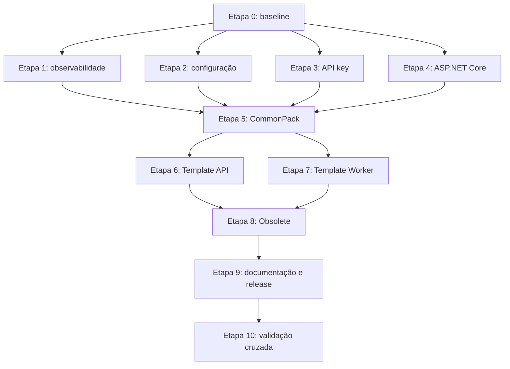

# Plano de modernização compatível do Middleware

## Gestão de Status

| Campo | Valor |
| --- | --- |
| Status | Em andamento |
| Criado em | 2026-08-20 |
| Atualizado em | 2026-08-21 |
| Responsável | Lincoln Zocateli |
| Última revisão | 2026-08-20 |

### Histórico de Status

| Data | De -> Para | Motivo |
| --- | --- | --- |
| 2026-08-20 | N/A -> Rascunho | Criação após análise do Nuuvify.CommonPack, CommonPack e templates |
| 2026-08-20 | Rascunho -> Rascunho | Revisão do contrato de `.env`, prefixos e KeyPerFile a partir de `LoadDotEnvBuilderExtensions` |
| 2026-08-20 | Rascunho -> Rascunho | Definição da implementação canônica no Nuuvify, proxies CommonPack e hardening de `Environment` |
| 2026-08-20 | Rascunho -> Em andamento | Implementação do hardening compatível concluída no pacote `Nuuvify.CommonPack.Middleware`; restante segue na modernização de maior porte |
| 2026-08-20 | Em andamento -> Em andamento | Implementação do contexto neutro e do esquema canônico de API key em `Nuuvify.CommonPack.Security` |
| 2026-08-21 | Em andamento -> Em andamento | Atualização dos Templates sobre `origin/master`, alinhamento Nuuvify 2.8.0 e desbloqueio do contrato de `CwsRepository` |
| 2026-08-21 | Em andamento -> Em andamento | Validação das soluções completas dos Templates após a publicação local dos pacotes Nuuvify 2.8.0 |

> A execução depende de revisão humana. Este documento não registra aprovação, conclusão ou autorização para publicação.

## Status de Execução

| Etapa | Status | Evidência |
| --- | --- | --- |
| 0. Baseline e contratos | Concluída | Snapshot do pacote e testes do Middleware com regressões de configuração |
| 1. Observabilidade neutra | Concluída | `OperationContext`, accessor `AsyncLocal`, escopo restaurável e testes de isolamento concorrente |
| 2. Configuração, `.env` e secrets | Em andamento | `AddContainerSecrets`, loader `AddDotEnvConfiguration`, captura em memória e remoção responsável de `Environment`; proxies CommonPack delegando para 2.8.0; testes de parser alinhados ao primeiro separador e valores vazios; resolvedor de path canônico sem duplicação e com regressão de caminho customizado |
| 3. API key em Security | Em andamento | Esquema `ApiKey`, validação de startup, comparação em tempo constante, adapter legado corrigido, integração OpenAPI opt-in e 15 testes Security aprovados |
| 4. Modernização ASP.NET Core | Em andamento | `ProblemDetailsExceptionHandler`, adapter HTTP de `OperationContext`, `AddCanonicalValidation` com HTTP 400 e suporte a `IMvcBuilder`; Template API passou a remover o filtro 417 legado do pipeline moderno |
| 5. Migração CommonPack | Em andamento | Proxies de API e Worker delegando para `AddContainerSecrets` e `AddDotEnvConfiguration`; `AzureServiceBuilderExtensions` deixou de copiar/remover variáveis `AzureKeyVault`; testes de API/Worker recompilados e iniciados; validação final dos consumidores pendente |
| 6. Migração TemplateDotnetApi | Em andamento | Middleware, observabilidade e Nuuvify 2.8.0 registrados; startup moderno de exceção, contexto e validação 400 ativo; `HomeController.Info` migrou de `RequestConfiguration` para `IHostEnvironment` e metadata do assembly; `MqClientRepository` e `SynchroRepository` usam `IOperationContextAccessor` com fallback compatível; `CwsRepository` atualizado; permanecem warnings transitivos NU1603 do CBL CommonPack 7.3.0 |
| 7. Migração TemplateDotnetWorker | Em andamento | CommonPack 8.6.2 e Nuuvify 2.8.0 registrados; accessor neutro registrado no DI, `OperationContext` criado por mensagem e repositórios HTTP usando correlation neutro com fallback; `GlobalUsings` corrigido; permanece warning transitivo NU1603 de `StackExchange.Redis` |
| 8. Ativação de APIs obsoletas | Em andamento | APIs de dotenv e paths marcadas com `Obsolete(error: false)` após migração dos consumidores internos; métodos legados de path agora delegam ao resolvedor canônico; APIs de `RequestConfiguration` e headers ainda aguardam migração |
| 9. Documentação e release | Concluída parcialmente | README, changelog e documentação pública do pacote atualizados |
| 10. Validação cruzada | Em andamento | API key Security validada com 15 testes aprovados e 0 falhas; primeira API obsoleta ativada; resolvedor de path com teste de regressão; repositórios HTTP dos dois Templates sem diagnósticos; builds executados com warnings transitivos NU1603 |

## Objetivo

Modernizar `Nuuvify.CommonPack.Middleware` sem remover APIs públicas na linha
atual. A iniciativa deve:

1. Criar substitutos canônicos para APIs que duplicam recursos do .NET ou
   misturam responsabilidades.
2. Migrar CommonPack, TemplateDotnetApi e TemplateDotnetWorker.
3. Marcar APIs legadas como obsoletas somente depois da migração conhecida.
4. Reservar remoções físicas para a próxima versão major.
5. Separar secrets montados reais, lidos com KeyPerFile, de arquivos `.env`
   monolíticos.
6. Impedir que o caminho canônico de `.env` transforme secrets em variáveis de
   ambiente do processo.
7. Remover dependências de configuração, hosting, HTTP e observabilidade das
   camadas Domain.

## Escopo

- `Nuuvify.CommonPack.Middleware` e `Middleware.Abstraction`.
- Novos pacotes `Nuuvify.CommonPack.Observability.Abstraction` e
  `Nuuvify.CommonPack.Observability`.
- API key em `Nuuvify.CommonPack.Security` e integração OpenAPI.
- Migração de consumidores em CommonPack.
- Migração de TemplateDotnetApi e TemplateDotnetWorker.
- Testes, READMEs, changelogs e validação SemVer dos pacotes afetados.

## Decisões Arquiteturais

1. Nenhuma API pública será removida nem terá assinatura ou valor padrão
   alterado na linha 2.x.
2. Correções de segurança podem alterar comportamento observável quando o
   impacto e a migração forem documentados e testados.
3. `[Obsolete(message, error: false)]` será aplicado somente após os
   consumidores conhecidos estarem migrados. Cada mensagem deve nomear o
   substituto e apontar para uma âncora específica do `README.md`.
4. Remoções físicas ocorrerão somente na próxima major, depois do inventário de
   uso e da publicação do guia de migração.
5. Serão criados apenas os pacotes de observabilidade aprovados. Nenhum pacote
   genérico de configuração ou arquivos será criado nesta linha.
6. Domain não poderá referenciar `IConfigurationCustom`, `IConfiguration`,
   `IOptions<T>`, `IHostEnvironment`, `HttpContext`, `RequestConfiguration`,
   `ProblemDetails`, Middleware ou Observability.
7. Configuração será vinculada no composition root e entregue às camadas
   internas por options próprias da infraestrutura ou valores imutáveis do
   domínio.
8. `Nuuvify.CommonPack.Middleware` continuará como adaptador ASP.NET Core e
   proprietário das extensões de bootstrap/configuração existentes.
9. `Nuuvify.CommonPack.Security` será o proprietário da autenticação por API
   key.
10. Upload e download usarão `IFormFile.CopyToAsync`, `OpenReadStream` e
    `ControllerBase.File`; não haverá abstração genérica de arquivos.

## Contrato de configuração, `.env` e secrets

### Fontes

- `appsettings.json` e arquivos por ambiente configuram a política de
  bootstrap.
- `--env=<arquivo>` seleciona um arquivo `.env` monolítico.
- Variáveis de ambiente reais continuam disponíveis pelo provider oficial.
- Diretórios já montados com um arquivo por chave usam KeyPerFile por meio de
  `AddContainerSecrets`.
- Argumentos de linha de comando permitem override operacional explícito.

### Precedência

A precedência canônica, da menor para a maior prioridade, será:

1. `appsettings*`.
2. `.env` de configuração.
3. Variáveis de ambiente reais.
4. KeyPerFile montado.
5. Linha de comando.

Um `.env` local não poderá sobrescrever silenciosamente um secret montado pelo
runtime. A composição deverá ser testada com a mesma chave em todas as fontes.

### Parser `.env`

O parser interno, sem dependência externa, deverá:

1. Separar chave e valor somente no primeiro `=`.
2. Preservar valor vazio e sinais `=` subsequentes.
3. Documentar e testar comentários e whitespace.
4. Converter `__` em `:` somente nas chaves registradas em configuração.
5. Não chamar `Environment.SetEnvironmentVariable`.
6. Não gravar arquivos temporários.
7. Não registrar nomes completos nem valores classificados como secret.

### Política de prefixos

Os prefixos serão definidos pelo desenvolvedor em uma seção tipada, por
exemplo `ConfigurationBootstrap:DotEnv`. Cada regra conterá:

- prefixo;
- classificação `Secret` ou `Configuration`;
- preservação ou remoção do prefixo na chave final;
- obrigatoriedade;
- tratamento de chave desconhecida;
- tratamento de colisões.

Prefixos vazios, duplicados ou sobrepostos serão validados no startup. A
política recomendada será falhar fechado para secret obrigatório ausente,
colisão ou chave desconhecida que possa conter dado sensível.

### KeyPerFile

`KeyPerFile` ficará reservado para sua semântica real: diretório com um arquivo
por chave. Um `.env` monolítico não será convertido em arquivos temporários.
`AddContainerSecrets` continuará delegando ao provider oficial, com
`optional=false` e `reloadOnChange=false` por padrão.

### Compatibilidade dos proxies CommonPack

A implementação canônica será movida para `Nuuvify.CommonPack.Middleware`, mas
as classes `LoadDotEnvBuilderExtensions` de CommonPack.Api e CommonPack.Worker
continuarão nos mesmos assemblies e namespaces.

Os proxies preservarão:

- nome de tipo e método;
- parâmetros e valores padrão;
- tipo de retorno;
- forma de chamada;
- compatibilidade binária e de código-fonte.

Por decisão de 2026-08-20, eles deixarão de publicar o conteúdo do `.env` em
`Environment`. Essa é a única quebra comportamental aprovada nesse fluxo e
será documentada como hardening de segurança, sem modo legado inseguro.

## Matriz de Migração das APIs

| API atual | Destino canônico | Compatibilidade na 2.x |
| --- | --- | --- |
| `AddEnvironmentVariablesToMemoryCollection` | Provider nativo para env real; loader `.env` direto para arquivo | Manter e depreciar após migração |
| `AddEnvironmentVariablesToKeyPerFile` | Loader `.env` direto ou `AddContainerSecrets`, conforme a origem | Manter assinatura; `[Obsolete(error: false)]` ativado após migração dos consumidores internos |
| `AddLoadDotEnvBuilder` | `AddDotEnvConfiguration` sobre `IHostApplicationBuilder` no Nuuvify | Manter como proxy; retirar mutação de `Environment` |
| `AddCustomKeyPerFile` | Options explícitas e `AddContainerSecrets` | Manter como proxy; não enumerar arquivos em log |
| `AddContainerSecrets` | Mesmo método, delegando a `AddKeyPerFile` | Manter e testar |
| `Set/GetPathSecretsToOSPlatform` e `PathSecrets` | `GetContainerSecretsPath` e `AddContainerSecrets` | Manter assinatura; `[Obsolete(error: false)]` ativado após migração dos consumidores internos |
| `IConfigurationCustom` e `ConfigurationCustom` | Options tipadas e valores explícitos | Manter adapter e depreciar após migração |
| `RequestConfiguration` | `IOperationContextAccessor` e `OperationContext` | Manter adapter e depreciar após migração |
| `HandlingHeadersMiddleware` | Adapter HTTP sobre `Activity` e contexto de operação | Manter fachada legada |
| `ApiKeyAttribute` e `ApiKeyFilter` | Authentication handler, scheme e policy em Security | Corrigir legado e depreciar após migração |
| `UseHttpRequestKeyVerifyMiddleware` | Policy de autenticação por API key | Manter legado e depreciar após migração |
| `ValidateModelStateCustomAttribute` e DTOs | `[ApiController]` e `ValidationProblemDetails` | Preservar contrato 417 legado |
| `GlobalExceptionHandlerMiddleware` | `IExceptionHandler` e `ProblemDetailsService` | Preservar envelope legado |
| `BaseCustomController` | `ActionResult<T>` e respostas explícitas | Preservar membros protegidos |
| `FileStreamResultCustom` | `ControllerBase.File` | Manter e depreciar após migração |
| `GetFilesBase64` | `CopyToAsync` ou `OpenReadStream` | Manter; remover estado morto apenas na major |
| Setups com três lifetimes | Um setup seguro por contexto | Manter fachadas; alertar sobre singleton |
| `AssemblyExtension` | Metadata do host e informational version | Manter interno |

## Etapas de Implementação

### Etapa 0 - Baseline público e testes de caracterização

1. Gerar snapshot da API pública de Middleware e Middleware.Abstraction.
2. Inventariar consumidores source-only, ignorando `bin`, `obj` e `Docs`.
3. Fixar JSON, status codes, headers, defaults, lifetimes, exceções e nomes
   públicos em testes.
4. Caracterizar `AddLoadDotEnvBuilder`: ordem dos providers, mutação de
   `Environment`, prefixos fixos, parsing, valores vazios e colisões.
5. Adicionar regressões para claim perdida em `ApiKeyFilter`, concorrência de
   `RequestConfiguration`, `EntryAssembly` nulo, configuração hierárquica,
   arquivos duplicados/grandes e streams descartáveis.
6. Classificar cada alteração como compatível, hardening documentado ou futura
   quebra de major.

Esta etapa bloqueia todas as alterações públicas.

### Etapa 1 - Criar observabilidade neutra

1. Criar `Nuuvify.CommonPack.Observability.Abstraction` em `netstandard2.1`,
   sem ASP.NET, hosting ou options.
2. Definir `OperationContext` imutável e `IOperationContextAccessor` mínimo
   para correlation, trace e metadata da aplicação.
3. Criar `Nuuvify.CommonPack.Observability` em `net8.0` com accessor baseado em
   escopo/`AsyncLocal` e integração com `Activity.Current`.
4. Não incluir IP, headers, configuração, conteúdo ou claims sensíveis no
   contrato neutro.
5. Adicionar testes, README, changelog, solução e empacotamento.
6. Para HTTP, popular o contexto por request; para Worker, abrir um contexto por
   mensagem ou job.
7. Provar isolamento com duas operações concorrentes.

### Etapa 2 - Implementar configuração canônica no Nuuvify

1. Criar uma classe pública dedicada ao bootstrap `.env` em
   `Nuuvify.CommonPack.Middleware`, separada das extensões legadas.
2. Expor uma única extensão sobre `IHostApplicationBuilder`, suficiente para
   `HostApplicationBuilder` e `WebApplicationBuilder` no .NET 8.
3. Usar nome distinto de `AddLoadDotEnvBuilder` para evitar ambiguidade com os
   proxies CommonPack.
4. Criar options públicas e regras de prefixo com documentação XML completa.
5. Permitir bind por seção de configuração e configuração programática.
6. Implementar parser interno conforme o contrato deste plano.
7. Compor providers na precedência acordada.
8. Manter `AddContainerSecrets` e completar seus testes de diretório
   obrigatório/opcional, hierarquia, reload e mount read-only.
9. Não enumerar nem registrar nomes de arquivos de secrets em produção.
10. Preservar as extensões legadas até a próxima major.

### Etapa 3 - Implementar autenticação por API key em Security

1. Criar options validadas, authentication handler, scheme e extensão de DI em
   `Nuuvify.CommonPack.Security`.
2. Colocar contratos neutros em Security.Abstraction somente se houver
   consumidor real.
3. Comparar credenciais sem expor segredo em claim, log ou resposta.
4. Claims conterão somente identidade ou identificador da credencial.
5. Corrigir a claim perdida em `ApiKeyFilter` e evitar converter falhas internas
   em 401 indiscriminadamente.
6. Integrar o scheme ao pacote OpenApi sem acoplar Security.Abstraction ao
   ASP.NET Core.

### Etapa 4 - Modernizar os adapters ASP.NET Core

1. Criar caminho canônico com `IExceptionHandler`, `AddProblemDetails` e
   `ProblemDetailsService`.
2. Preservar correlation/trace ID sem retornar detalhes internos.
3. Adicionar validação canônica com `[ApiController]`, `ApiBehaviorOptions` e
   `ValidationProblemDetails` usando 400.
4. Manter o filtro 417 e o envelope de exceção legados para consumidores não
   migrados.
5. Usar scopes/telemetria no novo caminho de logging.
6. Não expor ambiente ou build por header como padrão.
7. Criar um setup seguro por contexto; manter variantes legadas somente como
   fachadas.
8. Documentar alternativas nativas para upload e download.

As etapas 2, 3 e 4 podem ser executadas em paralelo depois da etapa 0.

### Etapa 5 - Migrar CommonPack

1. Reduzir as classes `LoadDotEnvBuilderExtensions` de API e Worker a proxies
   mínimos com chamada estática explícita ao Nuuvify.
2. Não mover nem apagar os arquivos CommonPack na linha atual.
3. Substituir `AzureKeyVault`, `Logging`, `ApplicationInsights` e
   `ServiceConfiguration` fixos por regras definidas em `appsettings`.
4. Fornecer defaults equivalentes somente no proxy quando a seção não existir.
5. Retirar `Environment.SetEnvironmentVariable` dos proxies.
6. Atualizar testes para verificar os valores em `builder.Configuration` e sua
   ausência em `Environment`.
7. Fazer `AddCustomKeyPerFile` resolver options e delegar a
   `AddContainerSecrets` sem enumerar arquivos.
8. Eliminar a segunda captura de `AzureKeyVault` em
   `AzureServiceBuilderExtensions`.
9. Refatorar `BaseController.Response` para construção explícita, preservando
   assinatura, status e JSON.
10. Usar contexto de operação por execução no Worker e retirar estado de
    request singleton.
11. Manter no CommonPack apenas testes de proxy e integração. A matriz de
    parsing e precedência pertence ao Nuuvify.

Esta etapa depende das etapas 1 a 4 e bloqueia a migração dos templates.

### Etapa 6 - Migrar TemplateDotnetApi

1. Atualizar startup e composition root para as APIs canônicas.
2. Migrar controllers de `BaseCustomController` para `ActionResult<T>` e
   respostas explícitas sem alterar contratos publicados.
3. Corrigir download para retornar `File(...)`, em vez de descartar o resultado
   criado por `FileStreamResultCustom`.
4. Migrar repositories, data, HTTP e e-mail para options tipadas com
   `ValidateOnStart` no Infra.IoC.
5. Remover `IConfigurationCustom` do Domain.
6. Mover `ExemploStorageService` para Application/Infra ou entregar ao domínio
   somente valores próprios e imutáveis.
7. Adotar policy de API key e ProblemDetails para APIs novas.
8. Preservar endpoints legados sob testes de contrato.

### Etapa 7 - Migrar TemplateDotnetWorker

1. Remover `IConfigurationCustom` do Domain, especialmente de
   `StorageExample/Services/ExemploStorageService`.
2. Mover orquestração de storage para Application/Infra.
3. Criar options específicas para Service Bus, URLs, storage, e-mail e banco no
   Infra.IoC, com validação no startup.
4. Não injetar `IOptions<T>` no Domain.
5. Criar contexto de operação por mensagem e integrar `ActivitySource`.
6. Propagar correlation ID para HTTP e Service Bus sem estado singleton.
7. Remover o registro singleton de `IConfigurationCustom` depois da migração de
   todos os usos.
8. Preservar ack, abandon, dead-letter, retry e cancellation.

As etapas 6 e 7 podem ocorrer em paralelo depois da etapa 5.

### Etapa 8 - Ativar `[Obsolete]`

1. Confirmar que CommonPack e os templates não usam mais as APIs da matriz
   destinadas à depreciação.
2. Aplicar `[Obsolete(message, error: false)]` sem alterar assinatura,
   namespace, defaults ou implementação pública.
3. Usar mensagens no formato: substituto concreto e
   `See README.md#<ancora-de-migracao>`.
4. Não marcar `AddContainerSecrets`, APIs novas de observabilidade, o novo
   handler de API key nem os adapters canônicos.
5. Compilar consumidores conhecidos com warnings-as-errors para provar ausência
   de usos obsoletos.

### Etapa 9 - Documentação, changelogs e release

1. Expandir o README de Middleware com tabela legado para substituto, exemplos
   API/Worker, limites de domínio, lifetimes e cronograma de remoção.
2. Criar READMEs NuGet para os pacotes de observabilidade.
3. Criar guia transversal de migração por cenário em `docs/`.
4. Atualizar as seções `[Não Lançado]` do changelog raiz e dos pacotes afetados.
5. Não alterar versão manualmente.
6. Publicar, quando autorizado, em ondas: prerelease com APIs novas, migração
   dos consumidores, minor com `[Obsolete]` e remoção somente na próxima major.

### Etapa 10 - Validação cruzada

#### Nuuvify.CommonPack

1. Executar format, testes focados, testes Unit e build da solução.
2. Executar pack Release e inspecionar README, changelog, XML e API pública.
3. Comparar o snapshot da API antes e depois.

#### CommonPack

1. Executar testes dos projetos Api e Worker.
2. Executar build da solução.
3. Provar que os dois proxies delegam ao mesmo método Nuuvify.
4. Usar consumidor compilado contra a versão anterior para validar resolução de
   assembly, tipo e método.

#### Templates

1. Executar testes focados e build completo de API e Worker.
2. Executar smoke tests de startup.
3. Validar contratos HTTP de sucesso, erro, model state, exceção, API key,
   headers e download.
4. Validar duas mensagens concorrentes com correlação isolada.
5. Validar options inválidas falhando no startup.

#### Bootstrap e containers

1. Testar `.env` via `--env=`.
2. Testar prefixos configuráveis, duplicados e sobrepostos.
3. Testar primeiro `=`, valor vazio, chave desconhecida e colisões.
4. Confirmar ausência de mutação em `Environment`.
5. Provar `appsettings*` < `.env` < env real < KeyPerFile < command line.
6. Montar `/run/secrets` read-only e testar fail-closed e optional.
7. Confirmar `Database__Password` como `Database:Password`.
8. Confirmar que `.env` não sobrescreve o mount.
9. Confirmar ausência de secrets em logs, claims e arquivos temporários.

#### Arquitetura

Adicionar teste que bloqueie referências de projetos Domain para Middleware,
Middleware.Abstraction, Observability, `IConfiguration` e Options.

## Dependências e Paralelismo

## Arquivos Relevantes

### Arquivos Nuuvify.CommonPack

- `src/Nuuvify.CommonPack.Middleware/Extensions/ConfigurationBuilderExtensions.cs`.
- `src/Nuuvify.CommonPack.Middleware/Extensions/DotEnvConfigurationBuilderExtensions.cs` (novo).
- `src/Nuuvify.CommonPack.Middleware/Configuration/DotEnvConfigurationOptions.cs` e tipos de regra (novos).
- `src/Nuuvify.CommonPack.Middleware/Configuration/DotEnvParser.cs` (novo e interno).
- `test/Nuuvify.CommonPack.Middleware.xTest/DotEnvConfigurationBuilderExtensionsTests.cs` (novo).
- `src/Nuuvify.CommonPack.Middleware/ConfigurationCustom.cs`.
- `src/Nuuvify.CommonPack.Middleware.Abstraction/Interfaces/IConfigurationCustom.cs`.
- `src/Nuuvify.CommonPack.Middleware.Abstraction/RequestConfiguration.cs`.
- `src/Nuuvify.CommonPack.Middleware/Setups/HandlingHeadersMiddleware.cs`.
- `src/Nuuvify.CommonPack.Middleware/Filters/ApiKeyAttribute.cs`.
- `src/Nuuvify.CommonPack.Security/**`.
- `src/Nuuvify.CommonPack.OpenApi/**`.
- `src/Nuuvify.CommonPack.Middleware/Setups/GlobalExceptionHandlerMiddleware.cs`.
- `src/Nuuvify.CommonPack.Middleware/Filters/ValidateModelAttribute*.cs`.
- `src/Nuuvify.CommonPack.Middleware/BaseCustomController.cs`.
- `src/Nuuvify.CommonPack.Middleware/FileStreamResultCustom.cs`.
- `src/Nuuvify.CommonPack.Middleware/Extensions/FormFileCollectionExtensions.cs`.
- `src/Nuuvify.CommonPack.Observability.Abstraction/**` e
  `src/Nuuvify.CommonPack.Observability/**` (novos).
- `Nuuvify.CommonPack.sln`, testes, READMEs e changelogs.

### Arquivos CommonPack

- `src/CBL.CommonPack.Api/Controllers/BaseController.cs`.
- `src/CBL.CommonPack.Api/Extensions/LoadDotEnvBuilderExtensions.cs`.
- `src/CBL.CommonPack.Worker/Extensions/LoadDotEnvBuilderExtensions.cs`.
- `src/CBL.CommonPack.Api/Extensions/AzureServiceBuilderExtensions.cs`.
- `src/CBL.CommonPack.Worker/Extensions/AzureServiceBuilderExtensions.cs`.
- `src/CBL.CommonPack.Api/Extensions/OpenTelemetryBuilderExtensions.cs`.
- Testes `LoadDotEnvBuilderExtensionsTests.cs` de API e Worker.

### TemplateDotnetApi

- `src/CBL.Template.Api/Services/ApplicationStartup.cs`.
- `src/CBL.Template.Api/Extensions/Architectures*Extensions.cs`.
- `src/CBL.Template.Api/v1/BaseController.cs`.
- `src/CBL.Template.Api/v1/Controllers/ArquivosController.cs`.
- `src/CBL.Template.Infra.IoC/DependencyInjectionRegisterExtensions.cs`.
- `src/CBL.Template.Infra.IoC/Configurations/**`.
- `src/CBL.Template.Domain/StorageExample/Services/ExemploStorageService.cs`.

### TemplateDotnetWorker

- `src/CBL.Template.NomeProcesso.Worker/Services/ApplicationStartup.cs`.
- `src/CBL.Template.NomeProcesso.Worker/Worker.cs`.
- `src/CBL.Template.NomeProcesso.Infra.IoC/DependencyInjectionRegisterExtensions.cs`.
- `src/CBL.Template.NomeProcesso.Infra.IoC/Configurations/**`.
- `src/CBL.Template.NomeProcesso.Domain/StorageExample/Services/ExemploStorageService.cs`.
- Repositories HTTP, Data e Bus consumidores de `IConfigurationCustom`.

## Fora de Escopo

- Remover fisicamente APIs públicas na linha 2.x.
- Alterar envelopes HTTP existentes sem versionamento explícito.
- Criar abstração genérica de configuração para Domain.
- Criar pacote genérico de arquivos ou uploads.
- Materializar `.env` em arquivos temporários para simular KeyPerFile.
- Prometer proteção criptográfica para valores fornecidos por `.env`.
- Reescrever Service Bus, retries, settlement ou UnitOfWork além do necessário
  para contexto e lifetime.
- Adicionar bibliotecas externas.
- Alterar versões, publicar pacotes ou fazer deploy sem autorização explícita.
- Corrigir warnings ou código não relacionado encontrado durante builds.

## Riscos e Mitigações

- **Risco:** consumidor depende de valores do `.env` em `Environment`.
  **Mitigação:** documentar o hardening, oferecer acesso por `IConfiguration` e
  atualizar todos os consumidores conhecidos no mesmo fluxo.
- **Risco:** alteração silenciosa da precedência.
  **Mitigação:** teste com a mesma chave em todas as fontes e documentação da
  ordem canônica.
- **Risco:** `[Obsolete]` quebra consumidores com warnings-as-errors.
  **Mitigação:** aplicar somente depois da migração e testar os consumidores.
- **Risco:** estado de correlação vaza entre operações concorrentes.
  **Mitigação:** accessor por escopo/`AsyncLocal` e testes concorrentes.
- **Risco:** nova abstração de observabilidade contamina Domain.
  **Mitigação:** teste arquitetural e uso restrito aos hosts/adapters.
- **Risco:** API key aparece em claim ou log.
  **Mitigação:** claim contém identificador, comparação não registra segredo e
  testes inspecionam logs e principal.
- **Risco:** contrato HTTP muda durante adoção de ProblemDetails.
  **Mitigação:** manter caminho legado e testes de contrato até versionamento
  explícito.
- **Risco:** diretório de secrets ausente passa silenciosamente.
  **Mitigação:** `optional=false` por padrão e validação no startup.

## Critérios de Aprovação

1. Todos os consumidores conhecidos usam APIs canônicas antes de `[Obsolete]`.
2. Nenhum projeto Domain referencia configuração, options, hosting, HTTP,
   Middleware ou Observability.
3. A linha 2.x preserva compatibilidade binária e de código-fonte das fachadas.
4. A única quebra comportamental aprovada no bootstrap é a retirada documentada
   da mutação de `Environment` por `AddLoadDotEnvBuilder`.
5. O caminho canônico de `.env` usa prefixos definidos pelo desenvolvedor, não
   muta `Environment` e possui política explícita para desconhecidos e colisões.
6. Secrets não são persistidos em temporários, promovidos ao ambiente, logados
   nem incluídos em claims.
7. KeyPerFile prevalece sobre `.env` e env real; command line prevalece quando o
   operador fizer override explícito.
8. Correlação fica isolada por request ou mensagem e integrada a `Activity`.
9. Testes focados e builds dos quatro repositórios passam.
10. Pack NuGet contém README, changelog e XML docs atualizados.
11. A próxima major possui lista explícita de símbolos removíveis, sem remoção
    antecipada.

## Estratégia de Release e SemVer

1. Disponibilizar APIs novas em prerelease, quando autorizado.
2. Migrar CommonPack e templates.
3. Publicar release minor com avisos `[Obsolete]`.
4. Inventariar consumidores e observar a janela de migração.
5. Remover APIs somente na próxima major, com guia de migração.
6. Não alterar versão nem publicar como parte da execução deste plano sem pedido
   explícito.

## Relação com o plano anterior

O plano `docs/plan/middleware-container-secrets-hardening.md` registra a correção
já realizada em `AddEnvironmentVariablesToKeyPerFile` e a criação de
`AddContainerSecrets`. Este plano amplia o trabalho para configuração `.env`,
observabilidade, autenticação, adapters ASP.NET Core e migração dos consumidores.
O histórico anterior permanece preservado e não será reaberto por este plano.
